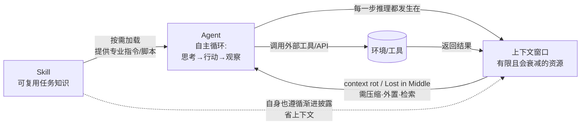

# 三个概念之间的关系：Agent、大模型的上下文、Skill

> 本文说明本仓库三份学习资料（[agent.html](learning-materials/agent.html)、[llm-context.html](learning-materials/llm-context.html)、[skill.html](learning-materials/skill.html)）中三个核心概念的内在联系。重点回答两个问题：
> 1. **上下文如何影响 Agent 的工作？**
> 2. **Skill 如何沉淀可复用的任务知识？**

---

## 一句话总览

- **Agent** 是"干活的智能体"，靠"思考 → 行动 → 观察"的循环完成任务；
- **上下文（Context）** 是 Agent 每一步"能看到的工作台"，是有限且会衰减的资源；
- **Skill** 是把"某类任务的专业知识"固化下来的文件包，让 Agent 在相关时被自动加载、变成专家。

三者关系可以概括为：**Skill 给 Agent 提供"能力"，Agent 在"上下文"这个有限舞台上调用这些能力与工具去完成任务。**

---

## 一、上下文如何影响 Agent 的工作

Agent 的自主循环（规划 → 选工具/行动 → 观察结果 → 再思考）会产生大量信息：系统指令、工具定义、每一步的工具返回、对话/任务历史、检索到的资料。这些**全部堆在上下文窗口里**。因此上下文直接决定 Agent 的能力边界：

| 上下文状态 | 对 Agent 的影响 |
| --- | --- |
| 窗口足够、信息精选 | Agent 能持续"记得目标、用对工具"，长任务跑得动 |
| 信息过多未管理 | 触发 **context rot**（越长越准度下降）、**Lost in the Middle**（中段信息被忽略） |
| 超出窗口上限 | 必须压缩 / 外置（Offload）/ 摘要（Reduce），否则停止或报错 |
| 错误/幻觉进入上下文 | **上下文中毒（Context Poisoning）**，错误被反复复用放大 |

所以，一个能稳定工作的 Agent，背后一定有一条"上下文工程"在支撑：在每一步只把"对下一步恰好有用的信息"放进窗口（Karpathy 的定义）。**没有好的上下文管理，Agent 越自主越容易"跑偏、变笨、忘事"。**

> 直观比喻：Agent 是个员工，上下文是他桌上的白板。白板写满且杂乱，他就开始犯错；好的上下文工程就是"帮他只把当前最关键的几张纸放在白板上"。

---

## 二、Skill 如何沉淀可复用的任务知识

Skill 解决的是"**同样的方法论每次都要重说**"的问题：

- 它把某类任务的专业知识（步骤、注意事项、模板、甚至脚本）固化成一个目录，核心是 `SKILL.md`（含 `name` + `description` 元数据与正文指令）。
- 它采用**三级渐进式披露**：未触发时只占极少量元数据（name+description，约 100 token），命中相关任务时才把正文读入上下文，脚本/参考更只是用到才加载——因此**几乎不浪费上下文**。
- 结果是：知识从"某次对话里的提示词"变成"仓库里、可版本化、可分享"的资产。任何人/任何会话只要任务相关，AI 就自动启用它。

在本仓库中，项目级 Skill `concept-learning-generator` 就是这种沉淀的体现：学 Agent、学上下文、学 Skill 自己，都只需一句"用这个 Skill 学 XXX"。

> 直观比喻：Skill 是给 Agent 写的"岗位说明书 / 入职手册"，一次编写，跨会话、跨概念复用。

---

## 三、三者如何串起来（关系图）

图例解读：
- **Skill → Agent**：Skill 在任务相关时被加载，赋予 Agent 特定领域的专业知识与流程。
- **Agent → 上下文**：Agent 的所有推理、工具调用、历史都发生在上下文窗口中，窗口大小与质量直接约束 Agent。
- **上下文 ↔ Agent（回环）**：上下文腐化会拖垮 Agent，因此 Agent 需要"上下文工程"反向治理（压缩/外置/检索）。
- **Agent → 工具 → 上下文**：工具结果回到上下文，既是 Agent 的"观察"，也是下一轮的输入，形成闭环。
- **Skill ⇢ 上下文**：Skill 本身通过渐进式披露，只在必要时占用上下文，避免"装一堆 Skill 就爆窗"。

---

## 四、我的个人判断（重点）

1. **上下文是 Agent 的"物理限制"，Skill 是 Agent 的"能力扩展"。** 二者一个决定"能不能跑稳"，一个决定"能不能变专业"，缺一不可。
2. **真正让 Agent 可用的，往往不是模型多大，而是上下文工程做得多好。** 本作业里"长任务忘事、跑偏"的根因几乎都在上下文，而不是模型能力不足。
3. **Skill 的价值在于"把经验变成资产"。** 它让个人或团队的方法论可复用、可审查、可进版本库——这也是本仓库存在的意义：既是一个 Skill，也是一份可继续迭代的作品集。

---

## 参考来源

- Agent 架构与 Workflow/Agent 区分：Anthropic《Building Effective Agents》<https://www.anthropic.com/research/building-effective-agents>
- 上下文工程（context rot / Lost in the Middle / 渐进披露）：Anthropic《Effective context engineering for AI agents》<https://www.anthropic.com/engineering/effective-context-engineering-for-ai-agents>
- Agent Skills 标准（三级披露、与 Prompt 区别）：Anthropic《Introducing Agent Skills》<https://www.anthropic.com/news/skills>
